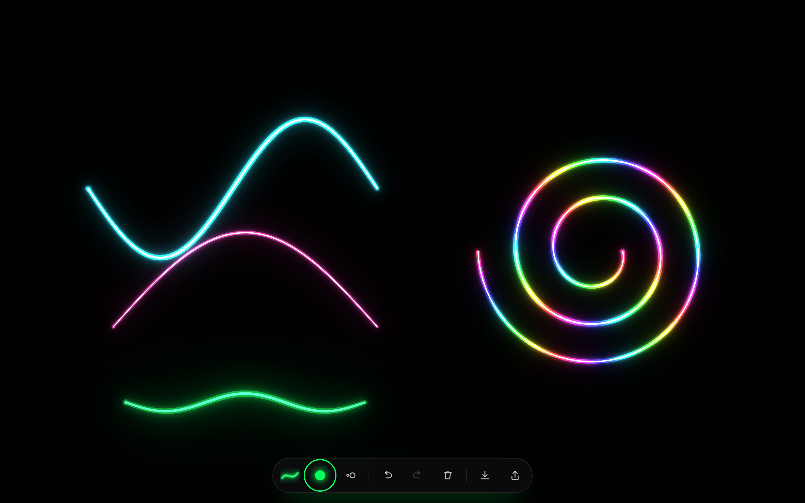
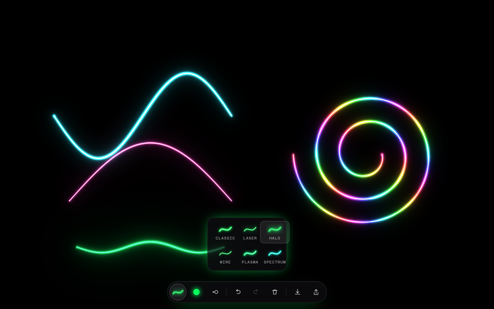

# Drawing

**A minimal neon sketchpad for Apple Pencil.** Pure black canvas, pressure-sensitive glow, nothing else in the way.

[](https://nextjs.org)
[](https://www.typescriptlang.org)
[](#testing)
[](LICENSE)



---

## Why

Most drawing apps put a workspace around the drawing. This one is the drawing. The canvas fills the screen,
the only chrome is a single glass pill that fades to almost nothing while you draw, and the ink is real neon:
a hot white core burning through a saturated halo, built from additive light rather than a fake outline.

## Features

| | |
|---|---|
| **Apple Pencil first** | Pressure drives stroke width; coalesced pointer events capture the full 120 Hz sample rate |
| **Palm rejection** | Once a Pencil has been seen, touch input is ignored - rest your hand on the glass |
| **6 neon styles** | Classic, Laser, Halo, Wire, plus Plasma and Spectrum, which rotate hue along the stroke |
| **7 inks, 2-48px brush** | Choices persist between sessions |
| **Always black** | The canvas is pure `#000000`, so what you export is what you drew |
| **Download or share** | PNG at device resolution, through the native share sheet on iPadOS and iOS |
| **Undo / redo / clear** | Toolbar or `Cmd+Z` / `Cmd+Shift+Z`; clear asks twice |
| **Installable** | Add to Home Screen for a fullscreen, chrome-free pad |



## Quick start

```bash
git clone https://github.com/bunlongheng/drawing.git
cd drawing
npm install
npm run dev
```

Open <http://localhost:3049>. To use it on an iPad on the same network, run
`npm run dev -- -H 0.0.0.0` and browse to your machine's LAN address on port 3049.

## Usage

| Action | How |
|---|---|
| Draw | Apple Pencil, finger, or mouse |
| Change style / ink / size | The three controls on the left of the toolbar |
| Undo / redo | Toolbar, or `Cmd+Z` and `Cmd+Shift+Z` (`Ctrl` on Windows and Linux) |
| Clear | Tap the bin, then tap again to confirm |
| Save a PNG | Toolbar, or `Cmd+S` |
| Share | The share button - native sheet where available, otherwise a download |

## How the neon works

Naive neon stacks progressively wider translucent copies of a stroke. That beads at the round caps wherever
samples overlap, and buries the bright core under the next segment's halo. This renders it the way a real
tube behaves instead:

1. Each stroke is painted **opaquely, twice** - once as a coloured tube, once as a narrow hot core - into
   scratch layers. Opaque paint makes re-stroking a pixel a no-op, so no beading, and the separate core layer
   can never be covered.
2. The glow is **bloom**: blurred copies of the tube added back on top. Additive light burns the centre
   toward white while the falloff stays saturated.
3. Blurred passes are accumulated at **quarter resolution**, because blur is low-frequency - 16x fewer pixels,
   no visible difference. Only the rectangle that changed since the last frame is rebuilt.

That last point is what keeps it usable: a long sweeping stroke went from 107 ms per frame to 8 ms, the
animation-frame floor.

The blur pad is 2.5 sigma rather than the textbook 3: the last half sigma falls below one 8-bit level
and costs about 17% more area to rebuild.

## Project layout

```
app/
  layout.tsx         fonts, metadata, viewport
  page.tsx           renders the canvas
  globals.css        design tokens and the toolbar styling
  manifest.ts        Add to Home Screen
  icon.png           app icon, shared with the dashboard and Stickies
  favicon.ico        32px fallback; apple-icon.png is the 180px touch icon
  error.tsx          shown if the browser refuses a 2D context
components/
  NeonCanvas.tsx     pointer handling, palm rejection, shortcuts, export
  RadioGroup.tsx     ARIA radio group with roving tabindex and arrow keys
  NeonCanvasClient.tsx  client-only boundary (a canvas app has nothing to server render)
  Toolbar.tsx        the floating control pill
  Popover.tsx        anchored panel used by the style, ink and size controls
  StrokePreview.tsx  style swatch, built from the same recipe as the canvas
  icons.tsx          line icons
lib/
  neon.ts            palette, style presets, colour and width maths (pure, unit tested)
  geometry.ts        damage-rectangle maths (pure, unit tested)
  engine.ts          canvas engine: layers, bloom, undo stack, PNG export
  export.ts          download and Web Share
tests/
  neon.test.ts       unit tests for lib/neon.ts
  geometry.test.ts   unit tests for the damage-rect maths
  engine.test.ts     engine state machine, on a small canvas stub
  e2e/               Playwright specs, run on Chromium and WebKit/iPad
```

React never re-renders during a stroke: `NeonEngine` owns the pixels and the component only reacts to
undo/redo availability.

## Environment variables

**None.** Drawing runs entirely in the browser - no database, no API keys, no server-side state, no
telemetry. `.env.example` documents this so the absence is deliberate rather than ambiguous. The only
optional local setting is `PORT`, for running the dev server somewhere other than 3049.

Nothing you draw leaves your device.

## Testing

```bash
npm run lint       # ESLint
npm run typecheck  # tsc --noEmit
npm run test       # Vitest - pure logic in lib/neon.ts
npm run test:e2e   # Playwright - real strokes, on Chromium and WebKit/iPad
npm run test:all   # both suites
```

The e2e suite drives synthetic `PointerEvent`s (Playwright's mouse helpers cannot set `pointerType` or
`pressure`) and asserts on the pixels the canvas actually produced.

## Deployment

Deploys to Vercel with no configuration beyond `vercel.json`:

```bash
vercel            # preview
vercel --prod     # production
```

| | |
|---|---|
| Build | `npm run build` |
| Start | `npm run start` (port 3049) |
| Install | `npm ci` |
| Output | Fully static - every route prerenders |

Security headers (CSP, HSTS, `X-Frame-Options`, `Referrer-Policy`, `Permissions-Policy`) are set in
`next.config.ts` and apply to every response.

## Browser support

Chrome, Edge, Safari 17+, and Firefox. The glow uses `CanvasRenderingContext2D.filter`; on anything older
the strokes still draw, just without bloom.

## Licence

[MIT](LICENSE) - Bunlong Heng
