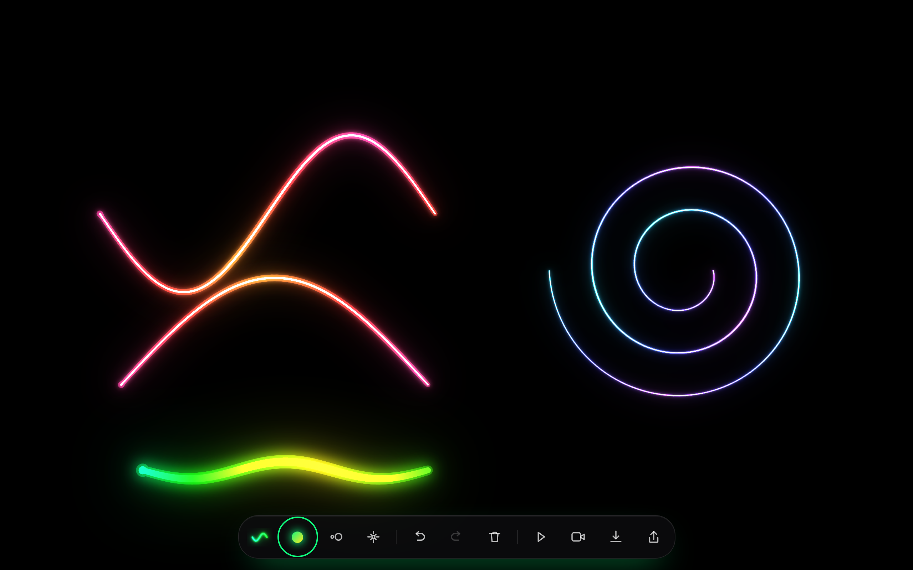
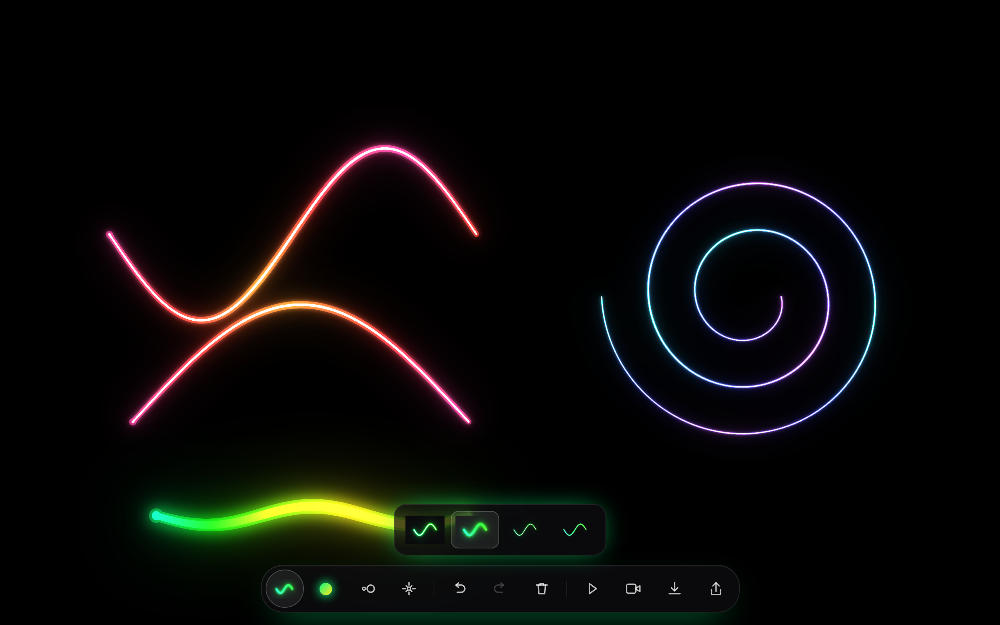
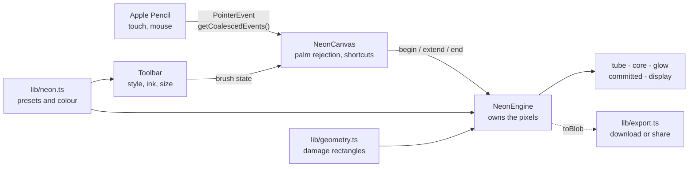
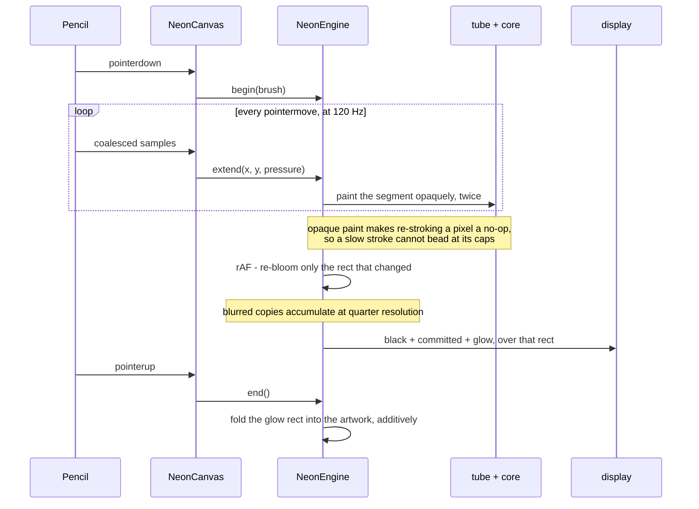

# Drawing

A minimal neon sketchpad for Apple Pencil. Pure black canvas, pressure-sensitive glow, one floating toolbar that fades out of the way while you draw - then download the result or send it straight to the share sheet.



[](LICENSE)


## Contents

- [Features](#features)
- [Architecture](#architecture)
- [How one stroke becomes neon](#how-one-stroke-becomes-neon)
- [Design decisions and trade-offs](#design-decisions-and-trade-offs)
- [Tech stack](#tech-stack)
- [Quick start](#quick-start)
- [Usage](#usage)
- [Configuration](#configuration)
- [Testing](#testing)
- [Deployment](#deployment)
- [Project layout](#project-layout)
- [Browser support](#browser-support)
- [License](#license)

## Features

- **Apple Pencil first.** Pressure drives stroke width, and coalesced pointer events capture the full 120 Hz sample rate rather than the 60 Hz the browser hands you by default.
- **Palm rejection.** Once a Pencil has been seen, touch input is ignored, so you can rest your hand on the glass.
- **4 neon styles,** chosen to differ in shape rather than in degree: **Classic** (white-hot core in a saturated halo), **Halo** (a fat soft light with no hard centre), **Laser** (a razor line with a fierce tight glow) and **Wire** (a flat coloured line, barely lit).
- **8 gradient inks.** Every ink is two stops the stroke eases between as it travels, so a line shifts colour along its length: Sunset, Ember, Toxic, Mint, Lagoon, Ultraviolet, Vapor and Frost.
- **6 ambient animations.** Off, Breathe (the drawing swells and dims), Flicker (an old sign), Sparkle (star glints), Firefly (motes drifting near the lines) and Flow (a bright head running the strokes like current through a tube).
- **Replay.** Press play and the drawing redraws itself stroke by stroke, anywhere from 0.1x to 3x, so someone can watch how it was made. The canvas locks while it plays, and the speed can be changed mid-playback.
- **Export the replay as video.** Record the playback to MP4 (H.264) where the browser supports it, WebM otherwise - captured at up to 1920px and 30fps, so the file stays small without looking soft.
- **A 2-48 px brush,** remembered between sessions along with the style and ink, and validated on the way back in.
- **Always black.** The canvas is pure `#000000`, so the PNG you export is exactly what you drew.
- **Download or share.** PNG at device resolution, through the native share sheet on iPadOS and iOS and a download everywhere else.
- **Undo, redo, clear.** Toolbar or `Cmd+Z` / `Cmd+Shift+Z` / `Cmd+S`; clear asks twice before erasing.
- **Installable.** Add to Home Screen for a fullscreen pad with no browser chrome.
- **Sharp at any zoom.** Resolution follows a pixel budget rather than a fixed cap, so zooming in buys detail instead of magnifying pixels. Drawing with a mouse gets a pencil cursor with the hotspot on its nib.



## Architecture

Three layers with one rule holding them apart: React never re-renders while a stroke is in flight. `NeonEngine` owns the pixels and is driven imperatively from the pointer handlers; the component only reacts to whether undo and redo are available. All the maths that does not need a DOM - presets, colour, width, damage rectangles - lives in pure modules, which is why it can be unit tested without a single mock.



| Layer | Role |
|-------|------|
| `app/` | Routing, metadata, viewport, manifest, error boundary |
| `components/` | React shell, toolbar, popover, radio group, style swatches |
| `lib/neon.ts` | Palette, style presets, colour and width maths - pure |
| `lib/geometry.ts` | Bounds and damage-rectangle maths - pure |
| `lib/engine.ts` | Canvas layers, bloom, undo stack, PNG encode |
| `lib/export.ts` | Download and Web Share, with fallbacks |

## How one stroke becomes neon

Naive neon stacks progressively wider translucent copies of a stroke. That beads at the round caps wherever samples overlap, and the next segment's halo buries the bright core of the last one. This renders it the way a real tube behaves instead.



1. Each stroke is painted **opaquely, twice** - once as a coloured tube, once as a narrow hot core - into scratch layers. Opaque paint makes re-stroking a pixel a no-op, so no beading, and the separate core layer can never be covered.
2. The glow is **bloom**: blurred copies of the tube added back on top. Additive light burns the centre toward white while the falloff stays saturated.
3. Blurred passes accumulate at **quarter resolution**, because blur is low-frequency - 16x fewer pixels, no visible difference - and only the rectangle that changed since the last frame is rebuilt.

That last point is what makes it usable: a long sweeping stroke went from **107 ms per frame to 8 ms**, the animation-frame floor.

## Design decisions and trade-offs

| Decision | Chosen | Alternative | Why this trade-off | Cost we accept |
|----------|--------|-------------|--------------------|----------------|
| Glow model | Additive bloom from blurred copies | `shadowBlur` per segment | Bloom saturates the centre to white the way a real tube does, and one blurred copy replaces thousands of shadowed segments | A second pair of scratch layers to keep the core off the tube |
| Bloom resolution | Quarter, upscaled | Full resolution | Blur is low-frequency, so 16x fewer pixels look identical | A quarter-res patch canvas |
| Repaint scope | Damage rectangle per frame | Repaint the canvas | Skia filters the whole source surface, so a full-canvas blur is 100 ms+ | Bounds tracking, and a pad wide enough that no seam shows |
| Blur pad | 2.5 sigma | 3 sigma | The last half sigma falls below one 8-bit level and costs 17% more area | A pad that is technically a hair short of the true tail |
| Undo | Rebuild from the stroke list, snapshot every 20 | Store an image per stroke | Additive pixels cannot be subtracted, and a snapshot per stroke would be hundreds of megabytes | One extra canvas, and one slow undo in twenty |
| Stroke state | Vectors, pixels derived | Pixels only | Undo, redo and resize stay correct rather than approximate | Every resize replays the drawing |
| Rendering owner | A plain class outside React | React state | Nothing re-renders during a stroke at 120 Hz | The engine is driven imperatively, by hand |
| Server rendering | None, client-only | SSR the shell | A canvas has nothing to prerender, and stored preferences seed the first paint with no hydration mismatch | A blank frame before hydration |
| Style swatches | Drawn by the real engine | An SVG lookalike | The picker cannot disagree with the brush, and the recipe exists in one place | A small canvas per swatch |
| Colour variation | Two-stop gradient inks | A rainbow hue-rotate style | Two neighbouring hues read as one ink shifting; a full spectrum sweep read as garish | A gradient needs a travel distance to show |
| Animation state | Pure functions of time | Particle objects updated per frame | Nothing drifts out of sync after a pause, and the maths is testable without a canvas | Positions are hashed, not simulated |
| Replay timing | Constant pace over samples | The original timestamps | A steady pace is easier to learn from, and no per-sample clock has to be stored | It does not reproduce your hesitations |
| Clip format | MP4 or WebM via MediaRecorder | An animated GIF | A GIF of a full-screen drawing is many times larger and caps at 256 colours, which a neon gradient cannot survive | No inline autoplay in some old chat clients |
| Clip resolution | Capped at 1920px, 30fps | The canvas as-is | An iPad canvas is 2700px wide, which encodes to a big file for no visible gain on playback | Not a pixel-exact capture |
| Canvas resolution | A pixel budget | A fixed device-ratio cap | A flat cap blurred the drawing exactly when someone zoomed in; a budget raises the ratio as the CSS box shrinks | A very large window renders below 4x |
| Bloom resolution | Half, upscaled | Quarter | A quarter was cheaper, but the upscale went chunky against a sharp core and read as blurry | Four times the blur work, still at the frame floor |
| Gradient progress | Triangle wave over distance | A ramp across the stroke | The total length is unknown while drawing, and easing back makes a long stroke a ribbon | A very long stroke repeats the sweep |

## Tech stack

- **Next.js 16** (App Router) and **React 19**, fully static - every route prerenders.
- **TypeScript**, strict, with `noUnusedLocals` and `noUnusedParameters`.
- **Tailwind CSS 4** for layout, hand-written CSS for the instrument itself.
- **HTML Canvas 2D** for all rendering, including the export.
- **Vitest** for the pure logic, **Playwright** for real strokes on Chromium and WebKit.
- **Zero runtime dependencies** beyond Next and React.

## Quick start

```bash
git clone https://github.com/bunlongheng/drawing.git
cd drawing
npm install
npm run dev
```

Open <http://localhost:3049>.

To draw on an iPad on the same network, run `npm run dev -- -H 0.0.0.0` and browse to your machine's LAN address on port 3049. Add it to your Home Screen for a fullscreen pad.

## Usage

| Action | How |
|--------|-----|
| Draw | Apple Pencil, finger, or mouse |
| Change style, ink or size | The three controls on the left of the toolbar |
| Undo / redo | Toolbar, or `Cmd+Z` and `Cmd+Shift+Z` (`Ctrl` on Windows and Linux) |
| Clear | Tap the bin, then tap again to confirm |
| Animate or set replay speed | The spark control in the toolbar |
| Export the replay as video | The camera button, next to play |
| Replay the drawing | The play button; the canvas locks and a speed strip appears until you stop it |
| Save a PNG | Toolbar, or `Cmd+S` |
| Share | The share button - native sheet where available, otherwise a download |

The toolbar fades while you draw and comes back when you lift off. Arrow keys move through the style and ink pickers.

## Configuration

**No environment variables required.** Drawing runs entirely in the browser: no database, no API keys, no server-side state, no telemetry. Nothing you draw leaves your device.

`.env.example` exists so that absence is documented rather than ambiguous. The only optional local setting is `PORT`, for running the dev server somewhere other than 3049.

## Testing

```bash
npm run lint       # ESLint
npm run typecheck  # tsc --noEmit
npm run test       # Vitest - 67 tests over the pure logic and the engine
npm run test:e2e   # Playwright - 33 cases on Chromium and WebKit/iPad
npm run test:all   # both suites
```

The e2e suite drives synthetic `PointerEvent`s, because Playwright's mouse helpers cannot set `pointerType` or `pressure`, and asserts on the pixels the canvas actually produced - including that the hot core stays saturated along a whole curved stroke.

## Deployment

Deploys to Vercel with no configuration beyond `vercel.json`:

```bash
vercel            # preview
vercel --prod     # production
```

| | |
|--|--|
| Build | `npm run build` |
| Start | `npm run start` (port 3049) |
| Install | `npm ci` |
| Output | Fully static |

Security headers - CSP, HSTS, `X-Frame-Options`, `Referrer-Policy`, `Permissions-Policy`, `Cross-Origin-Opener-Policy` - are set in `next.config.ts` and apply to every response.

## Project layout

```
app/
  layout.tsx         fonts, metadata, viewport
  page.tsx           renders the canvas
  globals.css        design tokens and the toolbar styling
  manifest.ts        Add to Home Screen
  error.tsx          shown if the browser refuses a 2D context
  icon.png           app icon, also the PWA icon
  apple-icon.png     180px touch icon for Add to Home Screen
components/
  NeonCanvas.tsx     pointer handling, palm rejection, shortcuts, export
  NeonCanvasClient.tsx  client-only boundary
  Toolbar.tsx        the floating control pill
  Popover.tsx        anchored panel used by the style, ink and size controls
  RadioGroup.tsx     ARIA radio group with roving tabindex and arrow keys
  StrokePreview.tsx  style swatch, drawn by the real engine
  icons.tsx          line icons
lib/
  neon.ts            palette, style presets, colour and width maths (pure)
  effects.ts         ambient animation, as pure functions of time (pure)
  geometry.ts        bounds and damage-rectangle maths (pure)
  engine.ts          canvas layers, bloom, undo stack, PNG export
  export.ts          download and Web Share
tests/
  neon.test.ts       style presets, colour and width maths
  geometry.test.ts   damage-rectangle clamping and padding
  engine.test.ts     engine state machine, on a small canvas stub
  e2e/               Playwright specs, Chromium and WebKit/iPad
```

## Browser support

Chrome, Edge, Safari 17+, and Firefox. The glow uses `CanvasRenderingContext2D.filter`; on anything older the strokes still draw, just without bloom.

## License

[MIT](LICENSE) (c) 2026 Bunlong Heng
